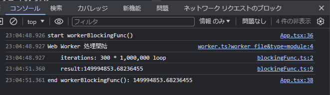

# ComlinkでWeb Workerを非同期関数として呼び出す手順(React+vite)

## はじめに

以前、[create-react-app(TypeScript)で作成したアプリにWeb Workerを導入する方法](https://qiita.com/murasuke/items/897faa6b2e6e071bbcd0)
という記事を書いたのですが、CRAは使わなくなってきたのでvite版の利用方法を調べました

### [Comlink](https://github.com/GoogleChromeLabs/comlink)とは

Googleが作成したライブラリです

公式サイトの説明
> Comlink makes WebWorkers enjoyable. Comlink is a tiny library (1.1kB), that removes the mental barrier of thinking about postMessage and hides the fact that you are working with workers.
> At a more abstract level it is an RPC implementation for postMessage and ES6 Proxies.

翻訳([DeepL](https://www.deepl.com/))
> ComlinkはWebWorkersを楽しくします。Comlinkは小さなライブラリ(1.1kB)で、postMessageについて考えるという精神的な障壁を取り除き、ワーカーを使っているという事実を隠してくれます。
> より抽象的なレベルでは、postMessageとES6プロキシのRPC実装です。

 * 平たく言うと
portMessageで呼び出す必要がある`Web Worker`を、非同期メソッドとして呼び出すことを可能にしてくれるライブラリ、といったイメージです


#### Comlinkを使わない場合の、Web Worker呼び出しコード例

* postMessage経由で処理を呼び出すため、見通しが悪くなります

```tsx
  const workerRef = useRef<Worker | null>(null);
  useEffect(() => {
    // Workerを生成
    workerRef.current = new Worker();
    // イベントで処理結果を受け取る
    workerRef.current.onmessage = (event) => {
      const data = event.data;
      console.log('メインスレッドで受信:', data);
    };

  }, []);

  // Web Worker 処理呼び出し(postMessage経由)
  const handleClickWorker = () => {
    workerRef.current.postMessage(roopCount);
  };
```

#### Comlinkを使う場合

```tsx
  const workerRef = useRef<Remote<typeof import('./worker')> | null>(null);

  useEffect(() => {
    // Workerを生成
    workerRef.current = new ComlinkWorker<typeof import('./worker')>(
      new URL('./worker', import.meta.url)
    );
  }, []);

  // comlinkにより、非同期関数化されます(awaitで完了の待ち合わせができる)
  const handleClickWorker = async () => {
    const result = await workerRef.current.workerBlockingFunc(roopCount);
  };
```

## 作成手順

画面イメージ


※「実行結果は・・・」はCSSアニメーションで左右に動いています。時間がかかる処理をWeb Workerで実行した場合、画面はブロックされません。

### プロジェクト作成
* viteでReactプロジェクトを作成

```bash
$ npm create vite@latest react_vite_web_worker  -- --template react-ts
$ cd react_vite_web_worker
$ code .
```

### comlinをインストール

* comlinkをインストールする
```bash
$ npm i complink
$ npm i -D vite-plugin-comlink
```

* `vite.config.ts`の設定変更

`vite-plugin-comlink`をimportして、pluginを設定します

```typescript:vite.config.ts
import { defineConfig } from 'vite';
import react from '@vitejs/plugin-react';
import { comlink } from 'vite-plugin-comlink';

// https://vitejs.dev/config/
export default defineConfig({
  plugins: [react(), comlink()],
  worker: {
    plugins: [comlink()],
  },
});
```

* comlinkの型定義

型定義を利用するため、下記1行を追加します
```typescript:./src/vite-env.d.ts
/// <reference types="vite-plugin-comlink/client" />
```

### 時間がかかるテスト関数を作成

そのまま実行すると、メインスレッド(画面の再描画)をブロックする関数を作成します

```typescript:./src/blockingFunc.ts
/**
 * 時間がかかる処理(iterations:300で2秒前後)
 * @param iterations
 * @returns random()の合計
 */
export const blockingFunc = (iterations: number): number => {
  console.log(`\titerations: ${iterations} * 1,000,000 loop`);

  let result = 0;
  for (let i = 0; i < iterations; i++) {
    for (let j = 0; j < 1_000_000; j++) {
      result += Math.random();
    }
  }
  console.log(`\tresult:${result}`);
  // randomの合計を返す
  return result;
};
```

### comlinkでWorker化する処理

Web Workerとして呼び出す処理をworker.tsに記載します（時間がかかるテスト関数を呼び出すだけ）

```typescript:./src/worker.ts
import { blockingFunc } from './blockingFunc';

export const workerBlockingFunc = (iterations: number): number => {
  console.log(`Web Worker 処理開始`);

  // randomの合計を返す
  return blockingFunc(iterations);
};

```

### ReactからWeb Workerを呼び出す

* Reactコンポーネントの`useEffect()`でWeb Workerを読み込む
* ボタンクリックでWeb Workerの処理を呼び出す
* 画面説明用ラベルをCSSアニメーションで左右に移動させる(ブロッキング確認のため)

```typescript:./src/App.tsx
import { useEffect, useRef } from 'react';
import type { Remote } from 'comlink';
import { blockingFunc } from './blockingFunc';
import './App.css';

function App() {
  const roopCount = 300;
  // ComlinkWorkerをuseRefで保持
  const workerRef = useRef<Remote<typeof import('./worker')> | null>(null);

  useEffect(() => {
    // Workerを生成
    workerRef.current = new ComlinkWorker<typeof import('./worker')>(
      new URL('./worker', import.meta.url)
    );
  }, []);

  // comlink(web worker)による非同期処理。アニメーションが止まらない
  const handleClickWorker = async () => {
    if (workerRef.current) {
      console.log('start workerBlockingFunc()');
      const result = await workerRef.current.workerBlockingFunc(roopCount);
      console.log(`end workerBlockingFunc(): ${result}`);
    }
  };

  // 同期処理(画面のアニメーションが止まる)
  const handleClickSync = async () => {
    if (workerRef.current) {
      console.log('start blockingFunc()');
      const result = blockingFunc(roopCount);
      console.log(`end blockingFunc(): ${result}`);
    }
  };

  return (
    <div>
      <button onClick={() => handleClickWorker()}>
        時間がかかる関数をcomlinkで非同期的に実行
      </button>
      <br />
      <button onClick={() => handleClickSync()}>
        時間がかかる関数を同期的に実行
      </button>
      <div className="return">実行結果はDevToolsのConsoleに出力されます。</div>
    </div>
  );
}

export default App;
```
### CSSにアニメーション効果を追加

画面描画がブロックされていることがわかるように、「実行結果は・・・」を左右にアニメーションさせる。


```css:./src/App.css
@keyframes return {
  50% {
    left: 200px;
  }
  100% {
    left: 0px;
  }
}

.return {
  width:  320px;
  position: relative;
  left: 0px;
  top: 0;

  animation-name: return;
  animation-duration: 3s;
  animation-iteration-count: infinite;
  animation-timing-function: ease;
}

```
## 動作確認

```bash
$ npm run dev

  VITE v5.1.5  ready in 191 ms

  ➜  Local:   http://localhost:5173/
  ➜  Network: use --host to expose
  ➜  press h + enter to show help
```
* コンソールを開いてから、ボタンをクリックすると各処理の流れを追うことができます
  * App.tsxからの呼び出し
  * Web Workerで実行
  * 2秒後にApp.tsxで処理結果を受け取る
  * 処理中、画面描画はブロックされない（アニメーションがなめらかに動作し続ける）

  

※「時間がかかる関数を同期的に実行」ボタンをクリックすると、画面が一時停止します


## 参考

https://www.npmjs.com/package/vite-plugin-comlink

https://dev.to/franciscomendes10866/how-to-use-service-workers-with-react-17p2
